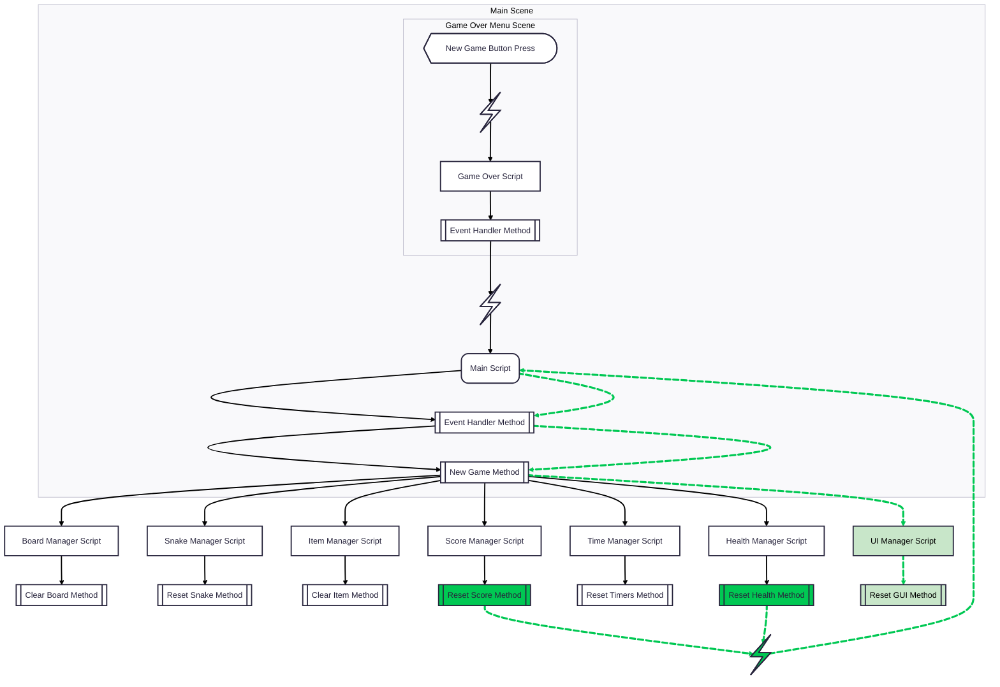

# Architecture: Crazy Snake

This document outlines the high-level architecture of **Crazy Snake**, a twist on the traditional Snake game built with Godot 4 and C#.

## Overview

The project follows a **Manager-based architecture** where a central controller (`Main.cs`) orchestrates specialized domain managers. Communication between components is primarily handled via **Godot Signals** to maintain loose coupling while allowing for complex interactions (like item effects modifying score or health).

## Core Components

### 1. Orchestration (`Main.cs`)
The `Main` class serves as the entry point and the "brain" of the game.
- **Responsibilities:**
    - Initializing all managers and injecting dependencies.
    - Connecting signals between managers (e.g., connecting `SnakeManager` movement to `HealthManager` logic).
    - Managing the primary game loop state (`NewGame`, `StartGame`, `EndGame`).
    - Handling high-level gameplay checks like `CheckEggEaten`, `CheckSelfEaten`, and `CheckItemHit`.

Future separation between object instantiation and signal connections, and  gameplay logic, may happen betwen `Main.cs` and the current stub, `GameController.cs`, respectively.

### 2. Domain Managers (`Scripts/Domain/Managers/`)
The business logic is divided into specialized managers, most of which inherit from `GodotObject` to leverage signals.

- **SnakeManager**: Manages the snake's physical presence, segment data, and movement logic. It handles the complex visual bending of the snake's neck and tail.
- **ItemManager**: Handles the spawning and lifecycle of items (eggs, walls, power-ups). It contains the placement logic to ensure items don't spawn inside the snake or in unreachable "traps."
- **ScoreManager**: Tracks the current score and manages the **Combo System**. It calculates multipliers (Combo X and Y) and processes the transition between regular play and "Crazy Combo" mode.
- **HealthManager**: Tracks player lives and manages the visual "Health Segments" (represented as snake segments) on the HUD.
- **UiManager**: Encapsulates all interactions with the Godot CanvasLayers. It handles score updates, HUD flashing effects, and game-over screens.
- **BoardManager**: Defines the grid boundaries and provides utility methods to check for out-of-bounds conditions.
- **TimeManager**: Wraps Godot `Timer` nodes to control game speed and effect durations.

### 3. Utilities (`Scripts/Domain/Utilities/`)
- **ItemEffectLogic**: A specialized class used by the `ItemManager` to apply gameplay modifiers (like reversing controls or restoring them) when specific items are consumed.
- **InputLogic**: Handles input mapping and transformations.

## Data Flow & Communication

### Signal-Driven Updates
Instead of managers calling each other directly, they emit signals that `Main.cs` listens for. 
*Example:* 
1. `ItemManager` detects a "Rotten Egg" was hit.
2. It emits `ScoreChanged`.
3. `Main` receives this and calls `Score.AddScore(...)` and `UI.HudFlash(...)`.
4. Some methods will emit further signals when other managers need to act next, like changing the GUI when the score is changed.



### The Combo System
The game features a unique scoring mechanic:
- **Tally**: Every egg eaten increases a tally.
- **Activation**: At a tally of 7, `ScoreManager` enters `IsInCombo` mode.
- **Calculation**: During a combo, score is calculated as `ComboPointsX * ComboPointsY`. Different items modify these variables differently (e.g., `Mushroom` starts/modifies X, while `Frog` modifies Y).

## Project Structure

```plain text
../Scripts/
├── Domain/
│   ├── Managers/     # Business logic (Snake, Score, Items, etc.)
│   └── Utilities/    # Pure logic helpers (Input, Item Effects)
├── GUI Scripts/      # Specific UI event handlers (Menus)
├── Interfaces/       # Decoupling contracts (e.g., ISnakeManager)
├── ../Main.cs        # Central Game Controller/Orchestrator
└── ../GameController.cs # (Under Construction)
```


## Key Technologies
- **Engine**: Godot 4.x
- **Language**: C# 12 (.NET 8)
- **Patterns**: Observer (Signals), Dependency Injection (via `Main.cs` initialization), and Component-based UI.

## Future Considerations
- **AudioManager**: Currently under construction; will eventually be integrated via the `Main` class to respond to gameplay signals.
- **Power-up Logic**: The `ItemEffectLogic` is designed to be expandable for more complex "twists" beyond control reversal.